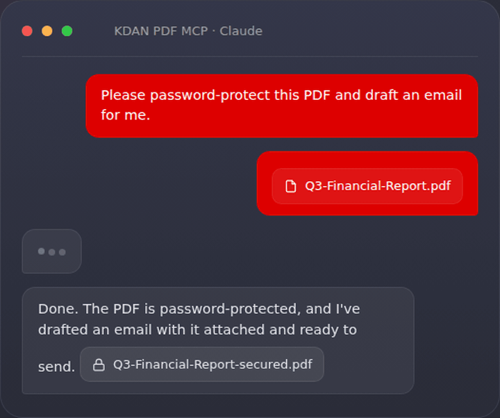
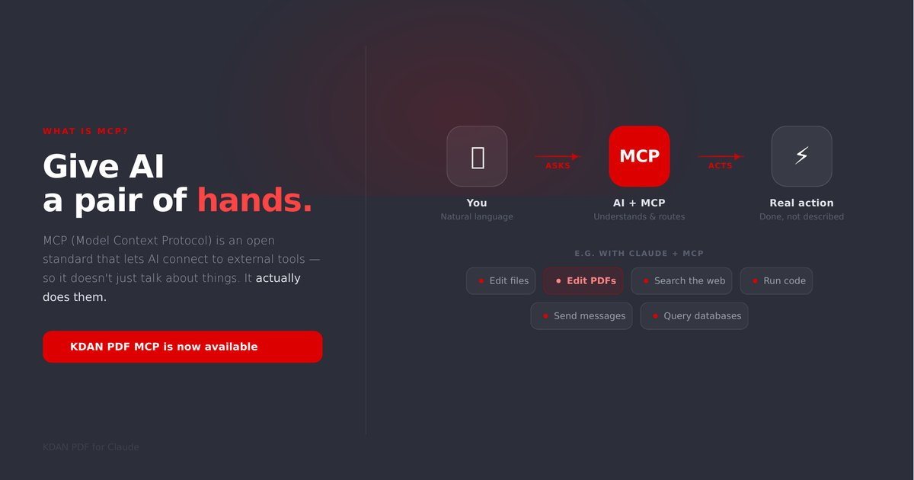
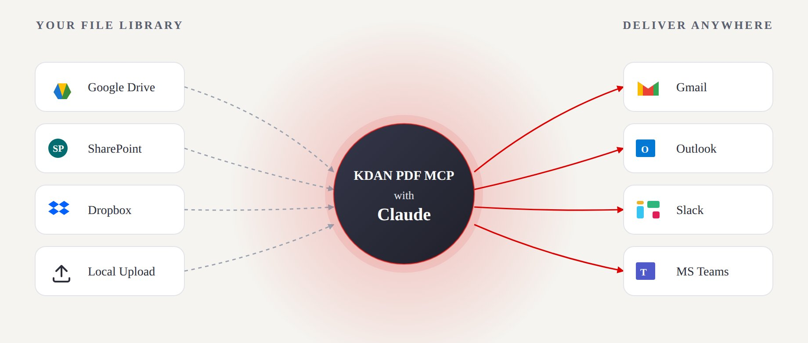
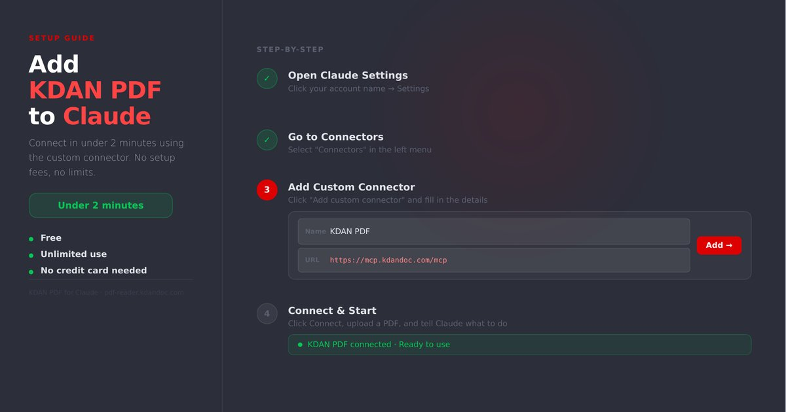
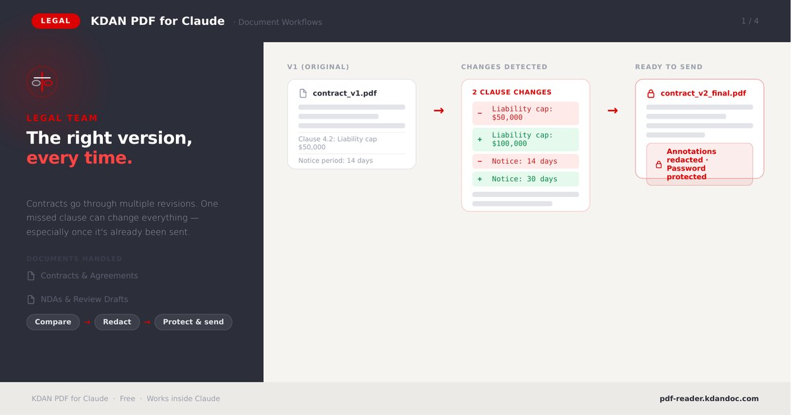
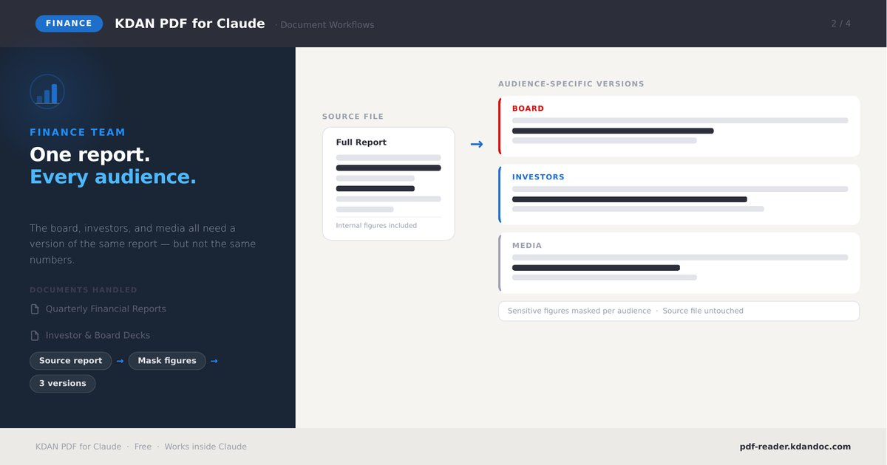
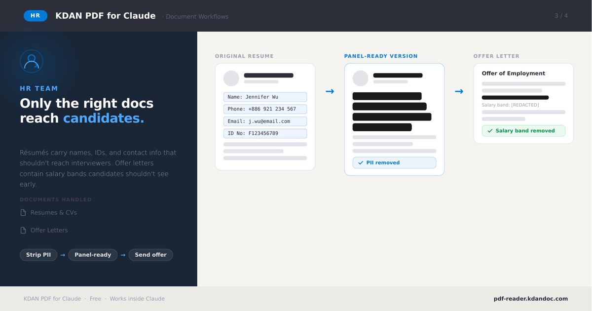
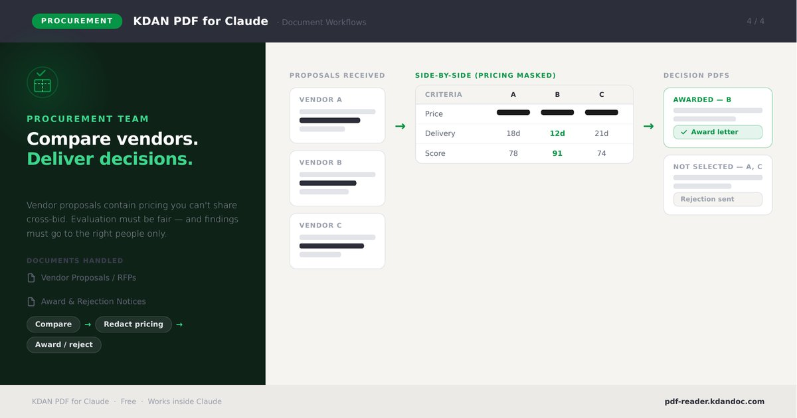
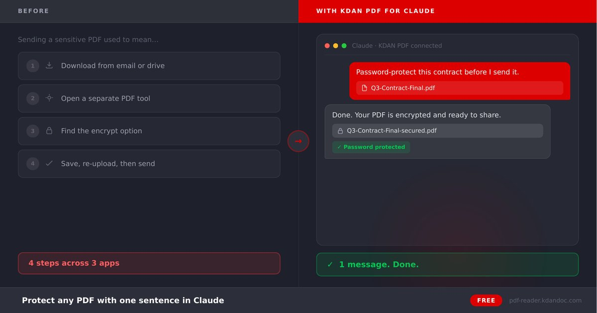
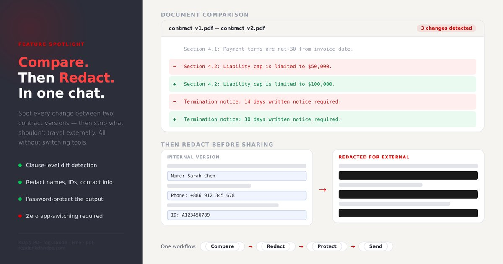

[](https://pdf-reader.kdandoc.com/products/mcp/claude)
[](https://github.com/KDAN-PDF/KDAN-PDF-MCP)
[](https://claude.ai/customize/connectors)
[](https://chatgpt.com)


# KDAN PDF MCP

**Organize, protect, compare & redact PDFs — just by chatting.**



**Contents:** [What is MCP?](#what-is-mcp-plain-english-version) ·
[Why KDAN PDF MCP](#why-kdan-pdf-mcp) ·
[How it works](#how-it-works) ·
[Setup on Claude](#setup-on-claude) ·
[Setup on ChatGPT](#setup-on-chatgpt) ·
[What you can do](#what-you-can-do) ·
[Tips](#tips-for-best-results) ·
[Built for every team](#built-for-every-team) ·
[Feature spotlights](#feature-spotlights) ·
[Prompt Pack & resources](#prompt-pack--resources) ·
[Privacy & security](#privacy--security) ·
[FAQ](#faq) ·
[Troubleshooting](#troubleshooting) ·
[Support](#support--feedback)

---

KDAN PDF MCP is a remote MCP server that lets users prepare PDFs with natural-language instructions. In supported AI assistants such as Claude or ChatGPT, users can ask KDAN PDF MCP to compress large files, remove selected pages, redact sensitive information, compare document versions, or add or update password protection before documents are shared, submitted, or reviewed.

## What is MCP? (Plain-English version)

Think of an AI assistant like Claude as very capable, but with no hands — on its own it can only *talk about* your PDF. MCP (Model Context Protocol) is an open standard that gives the AI a real pair of hands: it can now actually open your file, edit it, and save a new copy for you. **KDAN PDF MCP** is the connector that plugs KDAN PDF's editing tools into that assistant.

**No code, no installation, no account.** You paste one link into your AI assistant once, and from then on you just type what you want in plain language.



## Why KDAN PDF MCP

- **One sentence, done.** Replace the download → open another tool → find the right button → re-upload routine with a single message.
- **Free & unlimited.** No account, no credit card, no usage caps, no upsell.
- **True redaction.** Sensitive data is permanently removed, not hidden under a black box — built for compliance.
- **Stays in your conversation.** Compare, redact, protect and deliver without switching apps.

## How it works

Pull a file from wherever it lives, let KDAN PDF MCP + your AI assistant do the work, and send the result straight to where your team already is.



---

## Setup on Claude

Works on free accounts. Steps are the same for both Claude Desktop and claude.ai.

1. Click your account icon → **Settings**
2. Select **Connectors** → **Add Connector**
3. Paste the following URL:

```
https://mcp.kdandoc.com/mcp
```

4. Claude will walk you through the authorization flow to grant access.

Once connected, just tell Claude what you want — for example: *"Help me compress this PDF and remove page 3."*



---

## Setup on ChatGPT

May require a paid plan.

1. Go to [chatgpt.com](https://chatgpt.com), click your account icon → **Settings**
2. Select **Connectors** → **Add Connector**
3. Paste the following URL:

```
https://mcp.kdandoc.com/mcp
```

4. Complete the authorization flow to finish setup.

---

## What You Can Do

Once connected, try asking your AI assistant:

- "Upload this PDF."
- "Show me a preview."
- "Compress this PDF and tell me how much smaller it got."
- "Delete page 3 from this PDF."
- "Add a password to protect this contract."
- "Change the password of this PDF."
- "Redact the customer's email address on page 2."
- "Compare these two PDFs and highlight the differences side by side."
- "Give me a download link for the final file."

## Tips for best results

- Attach the PDF in the same message as your request.
- Be specific about pages and targets — e.g. *"redact emails and ID numbers on pages 2–4."*
- For multi-step jobs, chain them in one sentence: *"Compare v1 and v2, redact the names, then password-protect the result."*
- Ask for a *download link* when you want the finished file.

## Built for every team

The same connector fits seven everyday workflows:

| Team | Typical job | One-sentence example |
| --- | --- | --- |
| **Legal** | Compare contract versions, strip internal notes, protect before sending | "Compare v1 and v2, redact comments, then set a password." |
| **Finance** | One report, audience-specific versions with figures masked | "Mask the internal figures for the investor version." |
| **HR** | Remove PII from resumes; hide salary bands on offer letters | "Black out names, IDs and phone numbers on this resume." |
| **Procurement** | Compare vendor proposals with pricing masked; issue decisions | "Compare these three proposals and mask the pricing." |
| **Marketing & Sales** | Compress decks, protect proposals before sharing externally | "Compress this deck and password-protect it." |
| **Project Management** | Clean up specs, remove draft pages, share final copies | "Delete the draft pages and give me a clean copy." |
| **Engineering** | Redact credentials from logs/specs before distribution | "Redact any keys or emails in this document." |

<details>
<summary>See team workflow examples (Legal · Finance · HR · Procurement)</summary>






</details>

## Feature spotlights

<details>
<summary>Protect any PDF with one sentence</summary>



</details>

<details>
<summary>Compare, then redact, in one chat</summary>



</details>

## Prompt Pack & resources

- [User Guide](https://pdf-reader.kdandoc.com/products/mcp/claude-user-guide) — step-by-step setup walkthrough.
- [Prompt Pack](https://pdf-reader.kdandoc.com/products/mcp/claude-prompt-pack) — 24 ready-to-use prompts across 6 categories (Translate, Compare, Remove Pages, Encrypt, Redact, Compress).
- [Product page](https://pdf-reader.kdandoc.com/products/mcp/claude)

## Privacy & security

KDAN PDF MCP applies **true PDF redaction** — targeted content is permanently removed, not masked with an overlay, so it cannot be recovered from the output file. KDAN Mobile operates under GDPR, Taiwan PDPA and CCPA. For full details see KDAN's [Security](https://www.kdandoc.com/security), [Privacy Policy](https://www.kdandoc.com/privacy-policy) and [GDPR Compliance](https://www.kdandoc.com/gdpr-compliance) pages.

## FAQ

### Q1: Is KDAN PDF MCP free?
**A:** Yes — completely free and unlimited, with no upsell and no credit card required.

### Q2: Can it redact PII in a PDF?
**A:** Yes. Once national IDs, credit cards, emails and phone numbers are detected, KDAN PDF MCP applies permanent, compliance-ready redaction.

### Q3: How is this different from Claude's built-in PDF reading?
**A:** On its own, an AI assistant can only read a PDF. KDAN PDF MCP adds full editing — encrypt, delete pages, redact and save new copies — all through chat.

### Q4: Which AI assistants are supported?
**A:** Claude (web and desktop) and ChatGPT. Setup steps for each are above.

### Q5: Do I need a KDAN account?
**A:** No. There's no sign-up — paste the connector URL once and start using it.

### Q6: Can I use it on a free Claude plan?
**A:** Yes, KDAN PDF MCP works on free Claude accounts. ChatGPT may require a paid plan to add connectors.

### Q7: Does redaction actually remove the data, or just cover it?
**A:** It removes it. KDAN PDF MCP applies true redaction rather than a visual black box, so the underlying text can't be copied or recovered.

### Q8: What PDF tasks are supported?
**A:** Compress, delete pages, password-protect / change password, redact PII, compare two versions, preview, and generate a download link.

### Q9: What languages can I give instructions in?
**A:** You can chat in the language your AI assistant supports; instructions work in natural language.

## Troubleshooting

- **Connector doesn't appear?** Restart Claude Desktop after adding it, then check Settings → Connectors.
- **Authorization didn't complete?** Remove the connector and re-add the URL `https://mcp.kdandoc.com/mcp`.
- **Assistant only reads the PDF?** Confirm KDAN PDF MCP shows as connected, and mention "KDAN PDF" in your request.
- **Large file is slow?** Bigger PDFs take longer to process — let it finish before sending the next instruction.

## Support & feedback

- Product page & updates: [pdf-reader.kdandoc.com](https://pdf-reader.kdandoc.com)
- Questions or issues: open an [issue on GitHub](https://github.com/KDAN-PDF/KDAN-PDF-MCP/issues).
